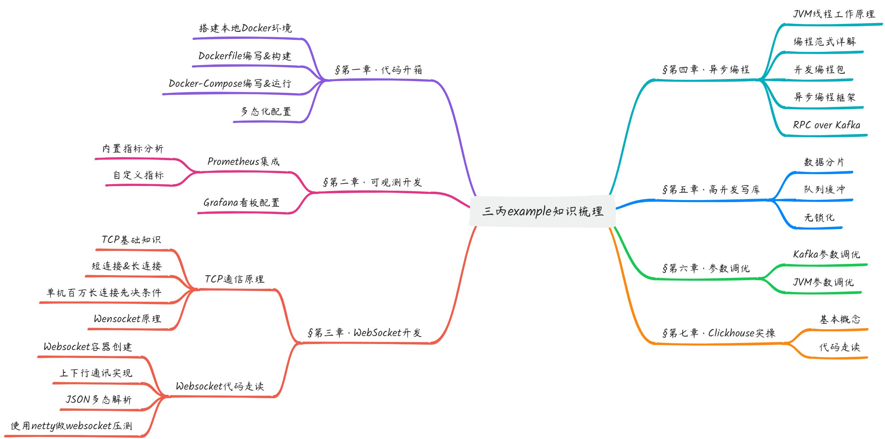

## 博主简介
**抖音：程序员三丙**

某上市厂高级架构师，担任10年架构师，技术面试官，当前闲余时间做自媒体，一边传播技能，一边孵化开源

## 加入我的社群
本项目有效JAVA代码量约2200行，而社区版约5000+行，社区包含了7篇跟项目配套的知识文档，三丙耗时近1个月熬夜编写😪，加入社区后不仅能获得除点赞场景外的其他代码，而且能获得这7篇文档，尤其是第4章异步编程干货满满。下面是配套知识文档大纲：

## 社群发展的方向
这个完结之后，以开源社群的形式，带粉丝们做几个完整的项目，会用到最新的后端技术栈以及云原生能力，带大家实战真正的高并发项目；目前正在筹划中的是一个充电桩项目，他的并发特性在于，它不像C端应用有潮汐流量，它是全天24小时不间断的数据上报！参与项目能获得的价值是：

+ 一起参与开源项目，项目中的关键代码和文档会在社群讲解，简历中可以直接引用参与过XX开源项目，面试时吊打中小厂面试官；
+ 学以致用，君子藏器于身，待时而动。因《加快构建新型电力系统行动方案(2024—2027年)》出台，能源物联网在未来3年内一定是爆发式行业风口；
+ 社群鼓励寻找志同道合和水平相当的兄弟，一起孵化有利于行业发展的开源项目。
+ 开源项目如参与商业活动，且你是贡献过代码的社群会员，将会获得额外收入。

星球是个付费社群，做会员制的目的是为高质量可持续的发展，当前早鸟价为 **129/年** ，加入三天内如果觉得对自己没有价值，可无理由退款。星球价格预计在《开源充电桩》项目第一版后涨到 **299/年** 。

## 社群的加入方式

